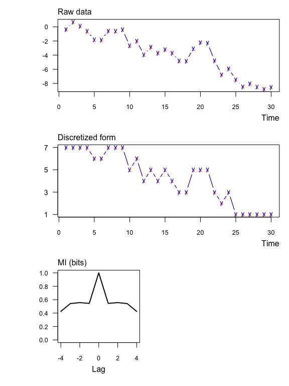

muti
====

`muti` is an `R` package that computes the mutual information (MI) between two discrete random variables *X* and *Y*. `muti` was developed with time series analysis in mind, but there is nothing tying the methods to a time index *per se*.

You can install the development version using `devtools`.

    if(!require("devtools")) {
      install.packages("devtools")
      library("devtools")
    }
    devtools::install_github("mdscheuerell/muti")

Background
----------

MI estimates the amount of information about one variable contained in another; it can be thought of as a nonparametric measure of the covariance between the two variables. MI is a function of entropy, which is the expected amount of information contained in a variable. If *P*(*X*) is the probability mass function of *X*, then the entropy of *X* is

*H*(*X*) = E\[-ln(P(X))\].

The MI between *X* and *Y* is then

MI(*X*,*Y*) = *H*(*X*) + *H*(*Y*) - *H*(*X*,*Y*)

where *H*(*X*,*Y*) is the joint entropy between *X* and *Y*. `muti` uses base-2 logarithms for calculating the entropies, so MI measures information content in units of "bits".

Data discretization
-------------------

`muti` computes MI based on 1 of 2 possible discretizations of the data:

1.  **Symbolic**. In this case the *i*-th datum is converted to 1 of 5 symbolic representations (*i.e.*, "peak", "decreasing", "same", "trough", "increasing") based on its value relative to the *i*-1 and *i*+1 values (see [Cazelles 2004](https://doi.org/10.1111/j.1461-0248.2004.00629.x) for details). Thus, the first and last values are undefined and the resulting symbolic vector is 2 values shorter than its original vector. For example, if the original vector was `c(1.1,2.1,3.3,1.2,3.1)`, then its symbolic vector would be `c("increasing","peak","trough")`.

2.  **Binned**. In this case each datum is placed into 1 of *n* equally spaced bins. If the number of bins is not specified, then it is calculated according to Rice's Rule whereby for vectors `x` and `y` of length `L`, `n = ceiling(2*L^(1/3))`.

I/O
---

**Input**. At a minimum `muti` requires two vectors of class `numeric` or `integer`. See `?muti` for all of the other function arguments.

**Output**. The output of `muti` is a data frame with the MI `MI_xy` and respective significance threshold value `MI_tv` at different lags. Note that a negative (positive) lag means *X* leads (trails) *Y*. For example, if comparing vectors `x` and `y` that were both `TT` units long, then the MI at a lag of -1 would be based on `x[1:(TT-1)]` and `y[2:TT]`.

Additionally, `muti` produces 3 plots of

1.  the original data (top);
2.  their symbolic or discretized form (middle);
3.  MI values (solid line) and their associated threshold values (dashed line) at different lags (bottom).

The significance thresholds are based on bootstraps of the original data. That process is relatively slow, so please be patient if asking for more than the default `mc=100` samples.

Examples
--------

### Ex 1: Real values as symbolic

Here's an example with significant information between two numeric vectors. Notice that none of the symbolic values are the "same".

``` r
set.seed(123)
TT <- 30
x1 <- rnorm(TT)
y1 <- x1 + rnorm(TT)
muti(x1, y1)
```


    ##   lag     MI_xy     MI_tv
    ## 1  -4 0.3122401 0.6396689
    ## 2  -3 0.5477111 0.5896470
    ## 3  -2 0.4896244 0.5868193
    ## 4  -1 0.6133082 0.5400706
    ## 5   0 0.7759290 0.6117563
    ## 6   1 0.4590565 0.6097824
    ## 7   2 0.1663024 0.5748355
    ## 8   3 0.2815102 0.5654351
    ## 9   4 0.4795740 0.6188139

### Ex 2: Integer values as symbolic

Here's an example with significant information between two integer vectors. Notice that in this case some of the symbolic values are the "same".

``` r
x2 <- rpois(TT,4)
y2 <- x2 + sample(c(-1,1), TT, replace = TRUE)
muti(x2, y2)
```


    ##   lag     MI_xy     MI_tv
    ## 1  -4 0.9622210 0.8510187
    ## 2  -3 0.5323156 0.7538786
    ## 3  -2 0.4511814 0.7758370
    ## 4  -1 0.7775874 0.7009295
    ## 5   0 0.9852553 0.6586393
    ## 6   1 0.9450356 0.7456378
    ## 7   2 0.5661902 0.8078943
    ## 8   3 0.6119224 0.8451717
    ## 9   4 0.7026058 0.8197471

### Ex 3: Real values as symbolic with normalized MI

Here are the same data as Ex 1 but with MI normalized to \[0,1\] (`normal = TRUE`). In this case MI'(*X*,*Y*) = MI(*X*,*Y*)/sqrt(*H*(*X*)\**H*(*Y*)) and the units are dimensionless.

``` r
muti(x1, y1, normal = TRUE)
```


    ##   lag      MI_xy     MI_tv
    ## 1  -4 0.16712589 0.3677492
    ## 2  -3 0.28904789 0.3135484
    ## 3  -2 0.26046030 0.3267956
    ## 4  -1 0.32544694 0.3009047
    ## 5   0 0.41446439 0.2896681
    ## 6   1 0.24575105 0.3207486
    ## 7   2 0.08846611 0.3305198
    ## 8   3 0.14856359 0.3199256
    ## 9   4 0.25457125 0.3376727

### Ex 4: Real values with binning

Here are the same data as Ex 1 but with regular binning instead of symbolic (`sym = FALSE`).

``` r
muti(x1, y1, sym = FALSE)
```


    ##   lag     MI_xy     MI_tv
    ## 1  -4 0.8820883 1.0915053
    ## 2  -3 0.8889416 1.0400937
    ## 3  -2 1.1275134 1.0351082
    ## 4  -1 0.8990155 1.0109159
    ## 5   0 1.0098951 1.0146187
    ## 6   1 0.7625273 0.9982514
    ## 7   2 1.0095443 0.9650760
    ## 8   3 0.8754405 1.0241878
    ## 9   4 0.9009431 1.1495736

### Ex 5: Auto-information

Here's an example of examining the normalized MI of a single time series at various time lags.

``` r
x3 <- cumsum(rnorm(TT))
muti(x3, x3, sym = FALSE, normal = TRUE)
```



    ##   lag     MI_xy     MI_tv
    ## 1  -4 0.5266503 0.3390241
    ## 2  -3 0.5481989 0.4890853
    ## 3  -2 0.5432998 0.4011222
    ## 4  -1 0.5568068 0.3533874
    ## 5   0 1.0000000 0.3128431
    ## 6   1 0.5568068 0.3255915
    ## 7   2 0.5432998 0.3886253
    ## 8   3 0.5481989 0.3524389
    ## 9   4 0.5266503 0.3736470
