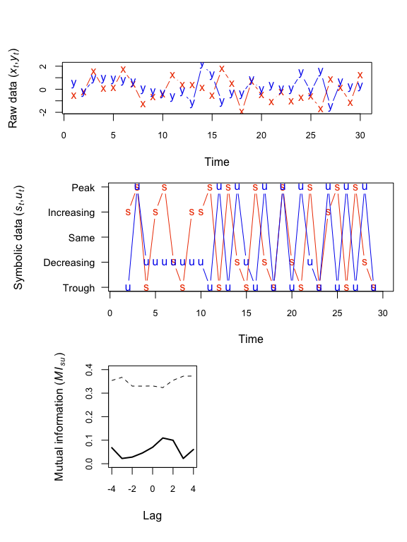
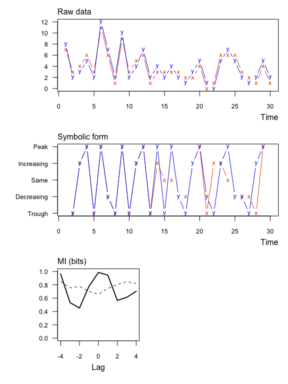
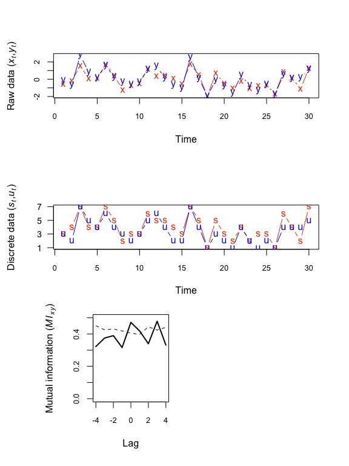
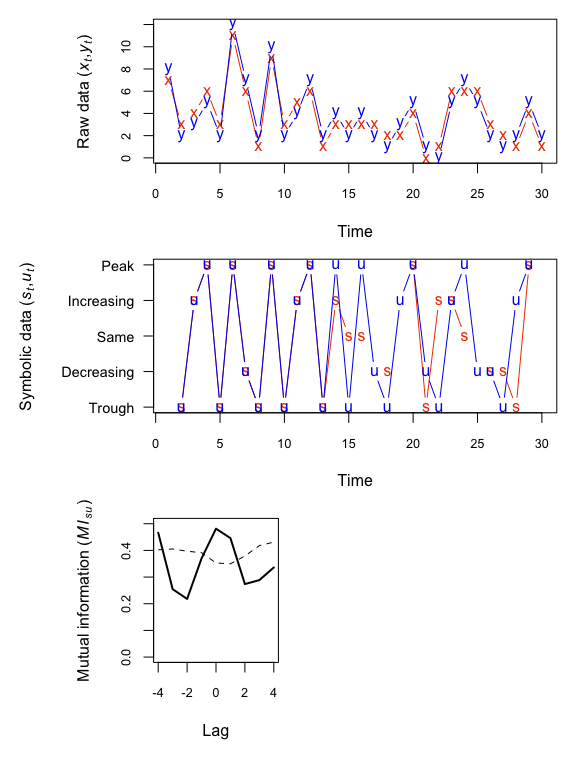

[](https://travis-ci.org/mdscheuerell/muti)

muti
====

`muti` is an `R` package that computes the mutual information (MI) between two discrete random variables *X* and *Y*. `muti` was developed with time series analysis in mind, but there is nothing tying the methods to a time index *per se*.

[](https://zenodo.org/badge/latestdoi/85351399)

Installation
------------

You can install the development version using `devtools`.

    if(!require("devtools")) {
      install.packages("devtools")
      library("devtools")
    }
    devtools::install_github("mdscheuerell/muti")

Background
----------

MI estimates the amount of information about one variable contained in another; it can be thought of as a nonparametric measure of the covariance between the two variables. MI is a function of entropy, which is the expected amount of information contained in a variable. The entropy of *X*, *H*(*X*), given its probability mass function, *P*(*X*), is

*H*(*X*) = E\[-ln(P(X))\].

The MI between *X* and *Y* is then

MI(*X*,*Y*) = *H*(*X*) + *H*(*Y*) - *H*(*X*,*Y*)

where *H*(*X*,*Y*) is the joint entropy between *X* and *Y*. `muti` uses base-2 logarithms for calculating the entropies, so MI measures information content in units of "bits".

Data discretization
-------------------

`muti` computes MI based on 1 of 2 possible discretizations of the data in a vector `x`:

1.  **Symbolic**. (Default) For `1 < i < length(x)`, `x[i]` is translated into 1 of 5 symbolic representations based on its value relative to `x[i-1]` and `x[i+1]`: "peak", "decreasing", "same", "trough", or "increasing". For example, the symbolic translation of the vector `c(1.1,2.1,3.3,1.2,3.1)` would be `c("increasing","peak","trough")`. For additional details, see [Cazelles (2004)](https://doi.org/10.1111/j.1461-0248.2004.00629.x).

2.  **Binned**. Each datum is placed into 1 of `n` equally spaced bins as in a histogram. If the number of bins is not specified, then it is calculated according to Rice's Rule where `n = ceiling(2*length(x)^(1/3))`.

I/O
---

**Input**. At a minimum `muti` requires two vectors of class `numeric` or `integer`. See `?muti` for all of the other function arguments.

**Output**. The output of `muti` is a data frame with the MI `MI_xy` and respective significance threshold value `MI_tv` at different lags. Note that a negative (positive) lag means *X* leads (trails) *Y*. For example, if `length(x) == length(y) == TT`, then the MI in `x` and `y` at a lag of -1 would be based on `x[1:(TT-1)]` and `y[2:TT]`.

Additionally, `muti` produces a 3-panel plot of

1.  the original data (top);
2.  their symbolic or discretized form (middle);
3.  MI values (solid line) and their associated threshold values (dashed line) at different lags (bottom).

The significance thresholds are based on a bootstrap of the original data. That process is relatively slow, so please be patient if asking for more than the default `mc=100` samples.

Examples
--------

### Ex 1: Real values as symbolic

Here's an example with significant information between two numeric vectors. Notice that none of the symbolic values are the "same".

``` r
set.seed(123)
TT <- 30
x1 <- rnorm(TT)
y1 <- x1 + rnorm(TT)
muti(x1, y1)
```



    ##   lag MI_xy MI_tv
    ## 1  -4 0.312 0.640
    ## 2  -3 0.548 0.590
    ## 3  -2 0.490 0.587
    ## 4  -1 0.613 0.540
    ## 5   0 0.776 0.612
    ## 6   1 0.459 0.610
    ## 7   2 0.166 0.575
    ## 8   3 0.282 0.565
    ## 9   4 0.480 0.619

### Ex 2: Integer values as symbolic

Here's an example with significant information between two integer vectors. Notice that in this case some of the symbolic values are the "same".

``` r
x2 <- rpois(TT,4)
y2 <- x2 + sample(c(-1,1), TT, replace = TRUE)
muti(x2, y2)
```



    ##   lag MI_xy MI_tv
    ## 1  -4 0.962 0.851
    ## 2  -3 0.532 0.754
    ## 3  -2 0.451 0.776
    ## 4  -1 0.778 0.701
    ## 5   0 0.985 0.659
    ## 6   1 0.945 0.746
    ## 7   2 0.566 0.808
    ## 8   3 0.612 0.845
    ## 9   4 0.703 0.820

### Ex 3: Real values as symbolic with normalized MI

Here are the same data as Ex 1 but with MI normalized to \[0,1\] (`normal = TRUE`). In this case MI'(*X*,*Y*) = MI(*X*,*Y*)/sqrt(*H*(*X*)\**H*(*Y*)) and the units are dimensionless.

``` r
muti(x1, y1, normal = TRUE)
```



    ##   lag MI_xy MI_tv
    ## 1  -4 0.167 0.368
    ## 2  -3 0.289 0.314
    ## 3  -2 0.260 0.327
    ## 4  -1 0.325 0.301
    ## 5   0 0.414 0.290
    ## 6   1 0.246 0.321
    ## 7   2 0.088 0.331
    ## 8   3 0.149 0.320
    ## 9   4 0.255 0.338

### Ex 4: Real values with binning

Here are the same data as Ex 1 but with regular binning instead of symbolic (`sym = FALSE`).

``` r
muti(x1, y1, sym = FALSE)
```



    ##   lag MI_xy MI_tv
    ## 1  -4 0.882 1.092
    ## 2  -3 0.889 1.040
    ## 3  -2 1.128 1.035
    ## 4  -1 0.899 1.011
    ## 5   0 1.010 1.015
    ## 6   1 0.763 0.998
    ## 7   2 1.010 0.965
    ## 8   3 0.875 1.024
    ## 9   4 0.901 1.150
